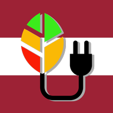
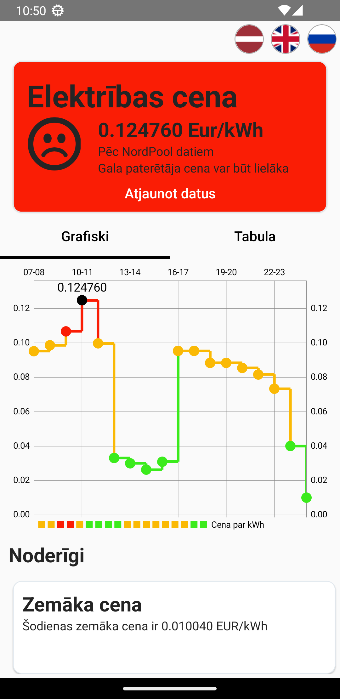

# Electrio App

    
    

        Monitor electricity price and save on your monthly utility bills!
    

    
    <!--  -->

## Screenshots

{: .home-screenshot}

## Features

- Electricity price forecast for next 24 hours
- Low, Normal and High price range
- Push notifications about low and high price
- Supports English, Latvian and Russian

## Support

Would you like to support the project? Just buy me a coffee!

